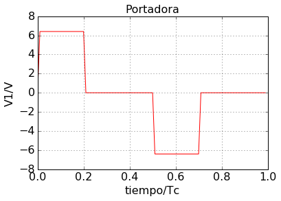

---
jupyter:
  jupytext:
    text_representation:
      extension: .Rmd
      format_name: rmarkdown
      format_version: '1.1'
      jupytext_version: 1.1.1
  kernelspec:
    display_name: Python 3
    language: python
    name: python3
---

<!-- #region -->
# Amplificador clase B.


El mismo está excitado por una señal de AM cuya portadora sin modulación siendo $T_c =0.1 us$. 


El amplificador de Clase B de la figura ha sido diseñado para maxima potencia de salida sin sobrepasar loa regímenes máximos del MOSFET. 


El mismo está excitado por una señal de AM cuya portadora sin modulación siendo Tc=0.1 us. 




El valor pico $V_1$ de la portadora rectangular varia en función de la señal modulante 

 $V_1 = 6.4 \cdot (1+0.8 cos(\omega_m \cdot t)) V$

donde $\omega_m = 2 \pi 100 Hz$


El tanque LC está sintonizado a $10 MHz$ ($Q_o = 200$ y $Qc = 10$ ).  La tensión de la fuente es $V_{DD}=110 V$.

La tensión mínima del MOSFET es de  $V_{DDmin}= 10 V$.

Determinar 

    1. RL, L y C.
    2. PEP: potencia en el pico de la envolvente sobre RL.
    3. VEP: potencia en el valle de la envolvente sobre RL.
    4. Poprom: potencia promedio disipada sobre RL en fundamental. 
    5. Pocarrie: potencia disipada sobre RL en 10 MHz si se corta la modulante.m 
    6. PDC: potencia de continua entregada por la fuente. 
    7. Pdis: potencia disipada en el MOSFET. 
    8. Pocarrie2: potencia disipada sobre RL en 20 MHz si se corta la modulante. 
    9. Índice de modulación a la salida $mo = \frac{Vp-Vv}{Vp+Vm}$ 
    10. La transmisión es capturada por un Rx de AM que detecta la señal con cero distorsión. 
        Dibuje lo que mostraría un osciloscopio conectado sobre el parlante indicando puntos singulares de dicho oscilograma. 


<!-- #endregion -->

```{python}

```
