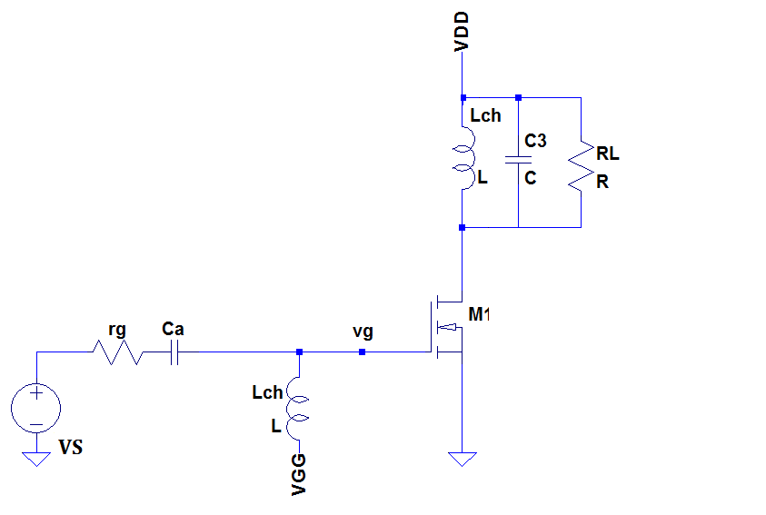
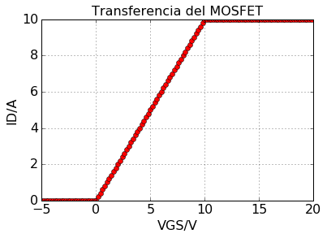
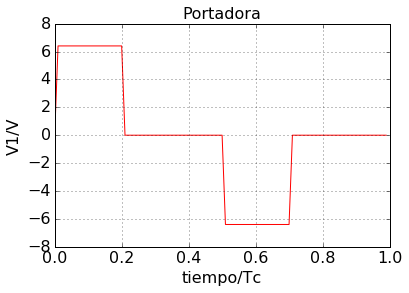

---
jupyter:
  jupytext:
    text_representation:
      extension: .Rmd
      format_name: rmarkdown
      format_version: '1.1'
      jupytext_version: 1.1.1
  kernelspec:
    display_name: Python 3
    language: python
    name: python3
---

<!-- #region -->
# Segundo parcial, amplificador clase B.

El amplificador de Clase B de la figura ha sido diseñado para maxima potencia de salida sin sobrepasar loa regímenes máximos del MOSFET. 




El mismo está excitado por una señal de AM cuya portadora sin modulación siendo Tc=0.1 us. 





El valor pico $V_1$ de la portadora rectangular varia en función de la señal modulante 

 $V_1 = 6.4 \cdot (1+0.8 cos(\omega_m \cdot t)) V$

donde $\omega_m = 2 \pi 100 Hz$


El tanque LC está sintonizado a $10 MHz$ ($Q_o = 200$ y $Qc = 10$ ).  La tensión de la fuente es $V_{DD}=110 V$.

La tensión mínima del MOSFET es de  $V_{DDmin}= 10 V$.

Determinar 

    1. RL, L y C.
    2. PEP: potencia en el pico de la envolvente sobre RL.
    3. VEP: potencia en el valle de la envolvente sobre RL.
    4. Poprom: potencia promedio disipada sobre RL en fundamental. 
    5. Pocarrie: potencia disipada sobre RL en 10 MHz si se corta la modulante.m 
    6. PDC: potencia de continua entregada por la fuente. 
    7. Pdis: potencia disipada en el MOSFET. 
    8. Pocarrie2: potencia disipada sobre RL en 20 MHz si se corta la modulante. 
    9. Índice de modulación a la salida $mo = \frac{Vp-Vv}{Vp+Vm}$ 
    10. La transmisión es capturada por un Rx de AM que detecta la señal con cero distorsión. 
        Dibuje lo que mostraría un osciloscopio conectado sobre el parlante indicando puntos singulares de dicho oscilograma. 


<!-- #endregion -->

<!-- #region -->
# Cálculo de RL, L y C

Que la portadora sea una señal rectangular implica que ademas de la componente fundamental, el espectro en frecuencia esta conformado por armonicos de la fundamental. Estos armonicos, en frecuencias multiplos de 10 MHz, luego seran atenuados por el filtro LC. Por lo tanto, para el análisis siguiente supondremos que en principio todos los armónicos son atenuados.      

La tensión de pico de vgs :

$ vgs(pico) = 6,4 \cdot (1 + 0,8 ) =  11.52 V$

por lo tanto, dada la transferencia del MOSFET:
$ i_{dsvalle} =  10 A$

## Cálculo para la condición de pico.

Dado que para el cálculo de la carga (RT) y el filtro se necesita conocer la corriente en condición de pico, se empleara para el calculo un pulso rectangular de 10 A de corriente de pico y $0.2 \cdot T$ de ancho. 

Dado la respuesta del MOSFET, solo los pulsos positivos de la señal de VGS son lo que generan corriente a la salida. 

A partir de los pulsos de corriente se debe obtener la componente de 10 MHz de la portadora para la condición de pico. 
A continuación se realiza el cálculo de forma analítica.


#### Cálculo de la componente $a_1$

$a_1 = \frac{1}{\pi} \cdot \int_{-\pi}^{\pi} ids(\theta) \cos(\theta) d\theta$

$a_1 = \frac{1}{\pi} \cdot \int_{\frac{-\pi}{5}}^{\frac{\pi}{5}} 10 A \cos(\theta) d\theta$

$a_1 = \frac{10 *2 A}{\pi} \cdot \int_{0}^{\frac{\pi}{5}}  \cos(\theta) d\theta$

$a_1 = \frac{10 *2 A}{\pi} \cdot (\sin(\frac{\pi}{5}) - \sin(0) )$

$a_1 = 10 \cdot 0.374 A $

$a_1 = 3,74 A $

#### Cálculo de la componente $b_1$

$b_1 = \frac{1}{\pi} \cdot \int_{-\pi}^{\pi} ids(\theta) \sin(\theta) d\theta$

$b_1 = \frac{1}{\pi} \cdot \int_{\frac{-\pi}{5}}^{\frac{\pi}{5}} 10 A \sin(\theta) d\theta$

$b_1 = \frac{10 A}{\pi} \cdot \int_{0}^{\frac{\pi}{5}}  \sin(\theta) d\theta$

$b_1 = \frac{10 A}{\pi} \cdot (- \cos(\frac{\pi}{5}) + \cos(\frac{\pi}{5}))  d\theta$

$b_1 =  10 \cdot 0 A $

$b_1 =  0 A $

#### Componente de 10 MHz de la portadora en condición pico. 

$idp =  3,74 A \cdot cos(2 \pi 10MHz \cdot t)$

Por lo tanto, el módulo de la corriente pico:

$ ipico = 3.74 A$


<!-- #endregion -->

<!-- #region -->
## Cálculo de RL, L y C


### Cálculo de RT 

Dado que VDD y VDSmin estan definidos, la tensión de la portadora en condición de pico no puede ser mayor a 

$ vomax = (VDD - VDSmin) = 100 V$

Entonces, la resistencia de carga será:

$ RT = \frac{vomax}{ipico}  $

$ RT = 26.73 \Omega $ 

### Cálculo de L 

$ L  = \frac{RT}{Qc \cdot wo} = 42,4 nHy$

### Cálculo de C 

$ C  = \frac{1}{L \cdot wo  2}  = 5,96 nF$

### Cálculo de RL


$ RL = \frac{wo \cdot L}{(1/Qc) - (1/Qo) } = 28,13 \Omega $ 

<!-- #endregion -->

# Cálculo de PEP sobre RL

En base a la corriente pico es posible calcular la potencia pico de la envolvente. 

$ PEP = \frac{(ipico \cdot RT)2}{2 \cdot RL}  = 170.91 W$

<!-- #region -->
# Cálculo de PEV sobre RL

## Componente id en condicion de valle en 10 MHz.

Para el cálculo de ivalle debemos emplear el mismo procedimiento que con la condición de pico, pero en este caso el valor máximo de la corriente es:


$ vgsvalle = 6,4 \cdot (1 - 0,8 ) = 1,27 V $

$ idsvalle = 1,27 A   $

#### Cálculo de la componente $a_1$

$a_1 = \frac{1}{\pi} \cdot \int_{-\pi}^{\pi} ids(\theta) \cos(\theta) d\theta$

$a_1 = 1,27 \cdot 0.374 A $

$a_1 = 0,478 A $
#### Cálculo de la componente $b_1$

$b_1 = \frac{1}{\pi} \cdot \int_{-\pi}^{\pi} ids(\theta) \sin(\theta) d\theta$

$b_1 =  1,27 \cdot 0 $

$b_1 =  0A $

#### Componente de 10 MHz de la portadora en condición pico. 

$idv =  0,474 A \cdot cos(2 \pi 10MHz \cdot t) $

Por lo tanto, el módulo de la corriente pico se calcula como:

$ivalle = 0,474 A  $


## Porencia sobre RL en condición de valle. 

$ PEV = \frac{(ivalle \cdot RT)2}{2 \cdot RL} = 2,7 W $

## Porencia sobre RL en condición de portadora. 

$ PEV = \frac{(icar \cdot RT)2}{2 \cdot RL} =  69,8 W $
<!-- #endregion -->

<!-- #region -->
# Potencia promedio sobre RL

Para el cálculo de la potencia promedio sobre RL es necesario conocer la componente portadora y sus bandas laterales. 

Dado que la envolvente esta distorsionada las bandas laterales, el espectro estará conformado por la fundamental y armónicos multiplos de esta.


Si el anlisis śe realiza con un perido completo de la modulante, el espectro completo estará conformado por una sumotaria de componentes multiplos de la frecuencia de la modulante. La frecuencia máxima del espectro esta definido por el teorema de muestreo de Nyquist-Shannon. 
Este analisis demanda estudiar la señal durante el periodo de la modulante ($\theta_m$), lo que es posible con la ayuda de computadoras, pero no muy práctico al realizarlo con calculadoras. 

Para simplificar el cálculo, lo que se propone es analizar a la portadora durante el periodo de esta ($\theta_m$), en distintas condiciones de la modulante. Al analizar solo los pulsos de la portadora, es posible conocer el espectro de la portadora en distintas condiciones de la modulante. Recordando que la fuente de corriente tiene de carga un filtro LC, es posible afectar a el espectro obtenido por el fitro. En un sentido práctico, este filtro atenua los armónicos de la portadora, por lo tanto, se calculará solo la fundamental de la portadora. 

En este ejercicio, los pulsos de corriente tiene un máximo en 10 A, para el cálculo supondremos que los pulsos de la portadora saturados son pulsos senoidales de 10 A. 


Para el calculo de los armonicos de la modulante, supondremos que es significativo hasta el tercer armónico de la envolvente, por lo tanto es necesario tomar al menos 7 muestas de la señal. Para el sieguiente análisis, se propone tomar 8 muestras de la envolvente, osea, tomamos una muestra cada 45 grados, lo que equivale a una muestra en los puntos : -180, -135, -90, -45, 0, 45, 90, 135 (notar que 180 no es parte del muestreo). 
En este caso, solo es necesario calcular la fundamental de la poratadora para cada uno de estos puntos de la envolvente. 

Dado que la señal envolvente es una señal coseno,  solo es necesario el calculo de los puntos -180, -135, -90, -45, 0,  ya que 45, 90, 135 tiene los mismos valores que sus correspondientes valores negativos. 

$a_1(\theta_m) = \frac{1}{\pi} \cdot \int_{-\pi}^{\pi} ids(\theta_c) \cos(\theta_c) d\theta_c$

Siendo el amplificador clase B, los pulsos de la portadora son proporcionales al pico del pulso, por lo tanto cada punto que se debe calcular corresponde a una multiplicación. 

$a_1(\theta_m) = id \cdot 0.374 A $


Como $ b_1 = 0 $, entonces $idc_1(\theta_m) = a_1(\theta_m)  $


NOTA: no olvidar que que se esta calculando la fundamentantal de los pulsos de la poratadora (en el periodo de un pulso de la portadora $\theta_c$), para distintos valores de la modulante ($\theta_m$)

donde A es el pico del pulso rectangular.


A continuación se adjunta una tabla con los valores de vgs, ids, a, b para cada uno de los puntos propuestos. 


|  $\theta_m$  | vgs($\theta_m$ )   | idc($\theta_m$)  |  idc$_{1}(\theta_m$)  | 
|--------------|:------------------:|:----------------:|:----------------:|
| -180         |   1.28   V         |       1.28  A    |  0.48  A         |
| -135         |   2.78   V         |       2.78  A    |  1.04  A         |
|  -90         |   6.40   V         |       6.40  A    |  2.39  A         |
|  -45         |  10.02   V         |      10.00  A    |  3.74  A         |
|    0         |  11.52   V         |      10.00  A    |  3.74  A         |
|   45         |  10.02   V         |      10.00  A    |  3.74  A         |
|   90         |   6.40   V         |       6.40  A    |  2.39  A         |
|  135         |   2.78   V         |       2.78  A    |  1.04   A        |


<!-- #endregion -->

<!-- #region -->
### Cálculo del espectro

Teniendo las 8 muestras, ahora estamos en condiciones de conocer los armónicos. 

Debido a que estamos empleando la serie trigonométrica de Fuorier, las componentes que obtendremos seran suma de las componentes de la banda lateral inferior con la superior. 


##### ao

$a_o = \frac{1}{n} \sum_{i=1}^{n} idc_1(\theta_m(i))$

donde n es el número de muestras.

$a_o = 2.321 A$ (ver tabla)

| $\theta_m$  |  idc$_1(\theta_m)$ | idc$_1(\theta_m$) |
|----|----|----|
|-180|0.48|0.48|
|-135|1.04|1.04|
| -90|2.39|2.39|
| -45|3.74|3.74|
|   0|3.74|3.74|
|  45|3.74|3.74|
|  90|2.39|2.39|
| 135|1.04|1.04|
 


##### a1 
$a_1 = \frac{1}{n} \sum_{i=0}^{n} idc_1(\theta_m(i)) \cdot cos(\theta_m(i) \cdot 1) $

$ a_1 = 1.77 A $ 

| $\theta_m$  |  idc$_1(\theta_m$) | idc$_1(\theta_m) \cdot cos(\theta_m$) |
|----|----|-----|
|-180|0.48|-0.48|
|-135|1.04|-0.74|
| -90|2.39| 0.00|
| -45|3.74| 2.64|
|   0|3.74| 3.74|
|  45|3.74| 2.64|
|  90|2.39| 0.00|
| 135|1.04|-0.74|
 


##### a2 
$a_2 = \frac{1}{n} \sum_{i=0}^{n} idc_1(\theta_m(i)) \cdot cos(\theta_m(i) \cdot 2) $

$ a_2 = -0.142$

| $\theta_m$  |  idc$_1(\theta_m$) | idc$_1(\theta_m) \cdot cos(\theta_m \cdot 2$) |
|----|----|-----|
|-180|0.48| 0.48|
|-135|1.04|-0.00|
| -90|2.39|-2.39|
| -45|3.74| 0.00|
|   0|3.74| 3.74|
|  45|3.74| 0.00|
|  90|2.39|-2.39|
| 135|1.04|-0.00|
 


###### a3 

$a3 = \frac{1}{n} \sum_{i=0}^{n} idc_1(\theta_m(i)) \cdot cos(\theta_m(i) \cdot 3) $

$a_3 = -0.139$

| $\theta_m$  |  idc$_1(\theta_m$) | idc$_1(\theta_m) \cdot cos(\theta_m \cdot 3$) |
|----|----|-----|
|-180|0.48|-0.48|
|-135|1.04| 0.74|
| -90|2.39|-0.00|
| -45|3.74|-2.64|
|   0|3.74| 3.74|
|  45|3.74|-2.64|
|  90|2.39|-0.00|
| 135|1.04| 0.74|
 


<!-- #endregion -->

Por lo tanto, las componentes resultantes :

$id(fc - 3 \cdot fm ) = 0.0695 A $

$id(fc - 2 \cdot fm ) = 0.0710 A $

$id(fc - 1 \cdot fm ) = 0.885 A $

$id(fc               ) = 2.321 A $

$id(fc  +  1 \cdot fm ) = 0.885 A $

$id(fc  +  2 \cdot fm ) = 0.071A $

$id(fc  +  3 \cdot fm ) = 0.0695 A $

Y la potencia sobre RL resulta :

$ PRL  = \frac{1}{2 \cdot RL} \cdot [(id(fc) \cdot RL )^2 + 2 \cdot  [ (id(fc + fm) \cdot RT )^2 + (id(fc+2 fm) \cdot RT )^2 +(id(fc+3fm)^2 \cdot RT )   ]$

$ PRL = 88.36 W $

### Si empleamos solo el calculo del promedio de la potencia sobre RL:

PotPromedio = (170.91 W + 2.7 W) / 2 = 86.8 W 

Donde podemos concluir que si bien hay una diferencia entre ambos valores, esta es pequeña, dado que la distorsión es pequeña. 


<!-- #region -->
# Potencia entregada por la fuente

Para el cálculo de la potencia entregada por la fuente se debe conocer la componente de continua de los pulsos de corriente en el Drain. 


El siguiente análisis, basado en los explicado para el calculo de la potancia sobre RL, propone tomar 8 muestras de la envolvente, osea, tomamos una muestra cada 45 grados, lo que equivale a una muestra en los puntos : -180, -135, -90, -45, 0, 45, 90, 135 (notar que 180 no es parte del muestreo). 


Dado que la señal envolvente es una señal coseno, basado en las supocisiones realizadas para el cálculo de la potencia de RL, solo es necesario el calculo de los puntos -180, -135, -90, -45, 0,  ya que 45, 90, 135 tiene los mismos valores que sus correspondientes valores negativos. 

$a_o = \frac{1}{2\pi} \int_{-\pi}^{\pi} id(\theta_i) d\theta$

$a_o = \frac{1}{2\pi} \int_{-\frac{\pi}{5}}^{\frac{\pi}{5}} idp d\theta$

$a_o = \frac{idp}{2\pi} \cdot (\frac{2\pi}{5})$

$a_o = \frac{idp}{5}$

Los pulsos de la portadora son proporcionales a la suma de los puntos del pulso, que luego es dividida por el número de muestras 

$a_o(\theta_m) = \frac{1}{n} \sum_{i=0}^{n-1} id(\theta_m) $


A continuación se adjunta una tabla con los valores de vgs, ids, a, b para cada uno de los puntos propuestos. 


|  $\theta_m$      |  vgs($\theta_m$)     |  idc( $\theta_m$)      |    $\frac{1}{5} \cdot$ idc( $\theta_m$)      | 
|----------|----------|----------|----------|
|-180| 1.28| 1.28| 0.26|
|-135| 2.78| 2.78| 0.56|
| -90| 6.40| 6.40| 1.28|
| -45| 10.02| 10.00| 2.00|
|   0| 11.52| 10.00| 2.00|
|  45| 10.02| 10.00| 2.00|
|  90| 6.40| 6.40| 1.28|
| 135| 2.78| 2.78| 0.56|

## Las corrientes entregadas por la fuente en distintas condiciones


### En el pico:

$ IDCp = 2A$

### En portadora:

$ IDCp = 1,28A$

### En valle:

$ IDCp = 0,26A$


## Las potencias entonces:

### En el pico:

$ PDCp = 2 A \cdot 100 V = 200 W $

### En portadora:

$ IDCc = 1,28 A  \cdot 100 V = 128 W$

### En valle:

$ IDCv = 0,26A \cdot 100 V = 26 W$


## Teniendo en cuenta el análisis armónico 

Por lo tanto, la corriente de continua (entregada por la fuente) se puede calcular como:

$IDC = \frac{1}{n} \sum_{i=0}^{n-1} id(\theta_i) =  1,24 A$

Potencia entregada por la fuente :

$ IDC = 1,24A \cdot 100 V = 124 W$

Empleando el promedio entre pico y valle:

$ IDC = (200W+26W)/2 = 113 W$
<!-- #endregion -->

# Disipada en el Transistor

Para el cálculo de la potencia disipada en el transisitor, tenemos que tener en cuenta la potencia que entrega la fuente, calculada anteriormente, y la potencia que se disispa en la carga y las perdidas del filtro. 

Dado que se ha calculado la potencia desarrollada sobre RL, se hace necesario calcular ahora la potencia total. Para ello, debemos emplear las corrientes obtenidas en el cálculo de la potencia sobre RL. Se recuerda que se ha despresiado de este análisis la potencia de los armónicos de la portadora, y que las bandas laterales no se ven afectadas por el filtro. 

Por lo tanto, las componentes resultantes :

$id(fc - 3 \cdot fm ) = 0.0695 A $

$id(fc - 2 \cdot fm ) = 0.0710 A $

$id(fc - 1 \cdot fm ) = 0.885 A $

$id(fc               ) = 2.321 A $

$id(fc  +  1 \cdot fm ) = 0.885 A $

$id(fc  +  2 \cdot fm ) = 0.071A $

$id(fc  +  3 \cdot fm ) = 0.0695 A $

Y la potencia sobre la carga y el fitro :

$ PLT  = \frac{RT}{2} \cdot [id(fc)^2  + 2  \cdot  [ id(fc + fm)^2 + id(fc+2 fm)^2 +id(fc+3fm)^2]$

donde RT = 26.7 $\Omega$

$ PLT = 93.09 W $

Otra manera mas simple :

$ PRT  = \frac{PRL \cdot RL}{RT} = 93.09 W $

Entonces, la potencia sobre el MOSFET:

$ P_{MOS} = PDC - PLT = 124W - 93.09 W = 30.9 W$


# Cálculos 
## Bibliotecas 

```{python}
# bibliotecas de funciones y circuito
import numpy as np
import matplotlib.pyplot as plt
import scipy                  # http://scipy.org/
from scipy import signal


# %matplotlib inline
params = {'legend.fontsize': 16,
          'figure.figsize': (12, 8),
         'axes.labelsize': 16,
         'axes.titlesize': 16,
         'xtick.labelsize':16,
         'ytick.labelsize':16}
plt.rcParams.update(params) 


```

## Se definen las señales a utilizar para las series de fourier.

```{python}
# Se definen las señales a utilizar para las series de fourier.
def myFourier(armonicos, x, y, dt, Tm):
    y_f = list()
    for a in armonicos: 
        if a == 0 : 
            yf_o = 0.0
            for i,xi in enumerate(x):
                yf_o += y[i]*dt/Tm
            y_f.append(yf_o)
        else : 
            yf_ac = 0.0
            yf_as = 0.0

            for i,xi in enumerate(x):
                yf_ac += 2.*dt/Tm * y[i]*np.cos(2*np.pi*a*xi)
                yf_as += 2.*dt/Tm * y[i]*np.sin(2*np.pi*a*xi)
            y_f.append(yf_ac+1j*yf_as)
    return y_f

def myFourierPh(a, x, y, n):
    if a == 0 : 
        yf_o = 0.0
        for i,xi in enumerate(x):
            yf_o += y[i]*1/n
        y_f= yf_o
    else : 
        yf_ac = 0.0
        yf_as = 0.0

        for i,xi in enumerate(x):
            yf_ac += 2./n * y[i]*np.cos(a*xi)
            yf_as += 2./n * y[i]*np.sin(a*xi)
        y_f = (yf_ac+1j*yf_as)
    return y_f

# filtro
def SS(vin,f, Qc, fo):
    return vin*(1/(1+1j*Qc*(f/fo-fo/f)))

```

```{python}
mo =(1.7/2.4)
print((100/(mo+1))**2/2/RL*(1+mo**2/2))


```

## Tensión de entrada: Portadora

Antes de responder las consignas, se mostraran las señales de entrada y de salida del circuito.

Se muestra la tensión de entrada, la cual corresponde a una senal AM. 

La portadora es una señal rectangular, probablemente producida por algun circuito digital.   

A continuación se ilustran dos periodos de la señal portadora. 

```{python}
# señal rectangular
def sqr(amp,d,th):
    return amp*signal.square(th,duty=d)

# señal portadora
def vcar(amp, th):
    return amp*( sqr(0.5,0.2,th +0.1*np.pi*2) - sqr(0.5,0.2,th+np.pi+0.1*np.pi*2) )

# modulación AM
def vam(m,vm,vc):
    return (1+m*vm)*vc
```

```{python}
#parametros de la senal AM
#(dadas las limitaciones de memoria y procesamiento, se emplea 100 como frecuencia de la portadoda)
amp = 6.4    #amplitud de la portadora
fc = 100    #frecuencia de la portadora 

m = 0.8      #indice de modulacion
fm = 2     #frecuencia de la modulante

#parametros del filtro de salida
Qc = 10
Qo = 200
#parametros del transistor
Vgs_min = 10 
Vgs_max = 210

VDD = 110 

# Defino el muestreo para el analisis
#tiempo de un periodo de la modulante
Tm  = 1/fm
Tc  = 1/fc
#Muestreo
fs  =  24*fc
#delta time para el calculo de los armonicos
ds  = 1/(fs)
```

```{python}
# se muestra un periodo de la señal fc (portadora)
time = np.arange(0,1/fc,1/fs)

# vector de vgs
vgs = []
for t in time:
    vm = 1                     # sin modulación
    vc = vcar(amp,2*np.pi*fc*t-0.21*np.pi) # portadora
    vgs.append( vam( m ,vm,vc)) # señal AM 

# Plot de la señal    
plt.plot(time/1e-7,vgs,'r')
plt.xlabel('tiempo/Tc')
plt.ylabel('V1/V')
plt.title('Portadora')
plt.grid()
#plt.xlim([0,Tm/20])
plt.show()
```

## Respuesta del transistor

Esta función representa la respuesta del transistor.

```{python}
def vgsi(VGG,Vs,th):
    return VGG+Vs*cos(th)

def idi(v):
    i = 0. if (v < 0.)  else 0
    i = (10./10.)*(v-0.) if (v >= 0  and v < 10) else i
    i = (10.) if (v >= 10 ) else i
    return i
vgs = np.arange(-5.,20.,0.2)

ids = []
for v in vgs:
    ids.append(idi(v))
    
plt.plot(vgs,ids,'ro')
plt.grid()
plt.title('Transferencia del MOSFET')
plt.ylabel('ID/A')
plt.xlabel('VGS/V')
plt.show()
```

## Tensión de entrada vgs AM modulada.


Esta señal portadora esta modulada por una señal senoidal. 

Se ilustra a continuación un periodo de la señal modulante. 

```{python}
time = np.arange(0,Tm,ds)
vgs = []
for t in time:
    vm = np.cos(2*np.pi*fm*t)
    vc = vcar(amp,2*np.pi*fc*t)
    vgs.append( vam( m ,vm,vc))

plt.plot(time,vgs,'r')
plt.xlabel('time/s')
plt.ylabel('VAM/V')
plt.title('vgs(t)')
plt.grid()
#plt.xlim([0,Tm/20])
plt.show()

```

### Analisis de Fourier para la senal AM de entrada:

```{python}
# vin_f es el vector del espectro en frecuencia  
vin_f = []

# se definen los armonicos (cada valor corresponde a la frecuencia del armónico)
maxArmon = int(fs/fm)/2
armonicos = np.arange(0,fm*maxArmon,fm)

# Fourier!
# myFourier(armonicos, time, señal, perido del muestreo, periodo de la frecuencia mínima)
# la salida es vector de números complejos
vin_f = myFourier(armonicos, time, vgs, ds, Tm)

# Plot!
plt.stem(armonicos[:],np.abs(vin_f[:])) 
plt.title('Fourier (modulo)')
plt.xlabel('frecuencia/Hz')
plt.xlim([-10,320])
plt.ylabel('vam/V')
plt.grid()
#print(np.abs(vin_f[49]),np.abs(vin_f[50]),np.abs(vin_f[51]))
```

## Corriente de salida del transistor. 

Debido a que es un amplificador Clase B, solo los pulsos positivos son los que conforman la señal de corriente. 

Como se muestra en el gráfico de la tensión de entrada, algunos de los pulsos supera los 10 V, por lo tanto, estos pulsos de corriente tendran 10 A a la salida. Esto se muestra en el gráfico siguiente.   

```{python}
# se define el vector de corriente
ids = []
for x,t in enumerate(time):
    # id = idi(vgs)
    ids.append(idi(vgs[x]))

# plot!    
plt.plot(time,ids)
plt.xlabel('time/s')
plt.ylabel('ids/A')
plt.title('ids(t)')
plt.grid()
plt.ylim([-1,11])

```

### Analisis de Fourier para la corriente de salida. 

Se muestra a continuación el espectro en frecuencia de la corriente de salida. 

Superpuesto al espectro, la respuesta del filtro.

```{python}
# Fourier
ids_mf = myFourier(armonicos, time, ids, ds, Tm)

plt.stem(armonicos[:],np.abs(ids_mf[:]) ) 
plt.plot(armonicos[1:],np.abs([SS(np.abs(ids_mf[50]),a,Qc,fc) for a in armonicos[1:] ]) , 'r.-' ) 
plt.xlabel('frecuencia/Hz')
plt.ylabel('id [A]')
plt.title('Fourier id(f)')
plt.xlim([-10,320])
plt.grid()
plt.show()
```

```{python}

plt.stem(armonicos[:],np.abs(ids_mf[:]) ) 
plt.plot(armonicos[1:],np.abs([SS(np.abs(ids_mf[50]),a,Qc,fc) for a in armonicos[1:] ]) , 'r' ) 
plt.xlabel('frecuencia/Hz')
plt.ylabel('id/A')
plt.title('Fourier id(f)')
plt.grid()
plt.xlim([90,110])
plt.show()

for i in [0,47,48,49,50,51,52,54]:
    print( 'ids({:2.0f})  = {:.3f}A '.format(armonicos[i],abs(ids_mf[i])) )

```

# Cálculo de la tensión de salida

Se incluye también el cálculo de la potenciasobre RL (que sera calculada luego).  

```{python}
# los valores de las resisntencias se calculan mas adelante
RT= 26.72 
RL= 28.13 

# Tensión de salida sobre el filtro de salida
vout_f = []
for x,i in enumerate(ids_mf[1:]):
    vout_f.append(SS(i*RT,armonicos[x+1],Qc,fc))

# Potencia sobre RL   
pot = sum([abs(v)**2/RL/2 for v in vout_f])
print('PRL = {:.2f} W'.format(pot) )    
    
# plot!    
plt.stem(armonicos[1:],np.abs(vout_f[:]))
plt.grid()
plt.title('Espectro de Vo')
plt.xlabel('frecuencia')
plt.ylabel('vout [V]')
plt.xlim([-10,310])
plt.show()
```

## Tensión sobre RL

```{python}
# Empleando el espectro en frecuencia, se obtiene la señal en timepo de vo
vo_t = list()
for t in time:
    vo = VDD
    for i,f in enumerate(armonicos[1:]):
        v = vout_f[i]
        vo = vo + v.real*np.cos(2*np.pi*f*t)+v.imag*np.sin(2*np.pi*f*t)
    vo_t.append(vo)

plt.plot(time, vo_t)
plt.xlim([0,Tm])

# Calculo de la tensión eficaz
voef = (ds/Tm*sum([(v-VDD)**2 for v in vo_t]))**0.5
print('Voeff = {:.2f} V'.format(voef))

# Potenicia sobre RL
potRL = voef**2/RL
print('PRL = {:.2f} W'.format(potRL))

```

# 1 ) RL, L y C 

## Cálculo para la condición de pico.
Dado que para el calculo de la carga y el filtro se necesita conocer la corriente en condición de pico, se empleara para el calculo un pulso rectangular de 10 A de corriente de pico y $0.2 \cdot T$ de ancho. 


```{python}
time = np.arange(-1/fc/2,1/fc/2,1/fs)

idsp = list()
for t in time:
    vm = 1
    vc = vcar(amp,2*np.pi*fc*t)
    idsp.append( idi(vam( m ,vm,vc)) )
    

plt.plot(time,idsp,'r')
plt.title('Idpico(t)')
plt.xlabel('time/s')
plt.ylabel('Id/A')
plt.grid()
plt.ylim([-1,11])
#plt.xlim([0,Tm/20])
plt.show()
```

```{python}
a1 = 20/np.pi*(np.sin(np.pi/5)-np.sin(0))
#print(20/np.pi*(np.sin(np.pi/5)-np.sin(0)))
b1 = 10/np.pi*(-np.cos(np.pi/5)+np.cos(-np.pi/5))
#print(20/np.pi*(-np.cos(np.pi/5)+np.cos(0)))
ipico = (a1**2+b1**2)**0.5

print('Ipico = {:.3} A'.format(ipico))
```

## Calculo de la resistencia de carga de salida teniendo la portadora en pico para el primer armonico de la modulante


 

```{python}
Vp  = 100
VDD = 110
print('VDD=', VDD, 'V')
print('Vp=' , Vp, 'V')
print(Qo,Qc)

RT = Vp /abs(ipico)

wo = 2*np.pi*10e6
L  = (RT/Qc)/wo
C  = 1/(L*wo**2)
RL = (wo*L)/((1/Qc) - (1/Qo) ) 


print('Respuestas 1.)')
print('L= {:3.2e} Hy'.format(L) )
print('C= {:3.2e} F'.format(C) )
print('RT= {:0.2f} ohms'.format(RT) )
print('RL= {:0.2f} ohms'.format(RL) )


```

## Verificación empleando Fourier para el calculo de la corriente en condición de pico.

```{python}
# Cálculo de las componentes de Fourier para el pulso de pico
maxArmon = int(fs/fc)/4
arm = np.arange(0,fc*maxArmon,fc)

idsp_f = myFourier(arm, time, idsp, 1/fs, 1/fc)

print('Ipico = {:.3} A'.format(abs(idsp_f[1])))

plt.stem(arm[:],np.abs(idsp_f[:])) 
plt.plot(armonicos[1:],np.abs([SS(np.abs(idsp_f[1]),a,Qc,fc) for a in armonicos[1:] ]) , 'r.-' ) 
plt.title('Espectro en frecuencia de Id en condición de pico')
plt.xlabel('frecuencia/Hz')
plt.ylabel('id/A')
plt.xlim([-50,550])
plt.grid()
plt.show()
```

# 2 ) PEP: potencia en el pico de la envolvente sobre RL

$ PEP = \frac{(Ip*RT)^2 }{2\cdot RL} $ 

```{python}
print(ipico)
PEP = (ipico*RT)**2 / RL /2

print('2) PEP = {:.2f} W'.format(PEP))
```

# 3 ) PEV: potencia en el valle de la envolvente sobre RL

$ PEV = \frac{(Iv*RT)^2 }{2\cdot RL} $ 


```{python}
vgsv = 6.4 *(1+0.8 *np.cos(np.pi))
idv = idi(vgsv)

print('Pico de vgs valle {:.2f} V'.format(vgsv))
print('Pico idv valle {:.2f} A'.format(idv))
```

```{python}
a1v = 1.28*0.374
b1v = 1.28*0


ivalle = (a1v**2+b1v**2)**0.5
print('ivalle = {:.2f} A'.format(ivalle))

PEV = abs(ivalle*RT)**2 / RL /2
print('3) PEV = {:.2f} W'.format(PEV))
```

# 4)  Potencia promedio sobre RL

Para el cálculo de la potencia promedia sobre RL, se muestrea la corriente producida por los pulsos sobre RL. 

Esto nos permite calcular el espectro de la señal envolvente, que luego será comparado con  el espectro completo.

El número máximo de armónicos nos permite conocer el espectro de las bandas laterales. 

El siguiente bloque de código calcula y muestra los valores de vgs, ids, a1, b1 y c1 para distintos valores de la modulante (la cantidad de valores depende de n).

El analisis solo tiene en cuenta la corrinte.

```{python}
n =8 # máximo armónico (n/2-1)  
th  = np.arange(-np.pi,np.pi,2*np.pi/n)

idp =  list() # corriente id
a1p =  list() # componente a1 del pulso de la portadora para las distintas condiciones de la modulante
b1p =  list() # idem a1
c1p =  list() # módulo (a1,b1)  

print('|  th      |  vgs     |  id      |   ao     | ' )
print('|----------|----------|----------|----------|')
for t in th:
    vgs = 6.4 *(1+0.8 *np.cos(t))
    idp.append(idi(vgs))
    a1p.append(idp[-1] * 0.2)
    print('|{:4.0f}| {:4.2f}| {:4.2f}| {:4.2f}|'.format( t*180/np.pi, vgs, idp[-1], a1p[-1]) )

print(sum(a1p)/n)    
plt.stem(th,(a1p) )
plt.title('Espectro de las componentes de c1 para distintos valores de la modulante')
plt.xlabel('radianes de la modulante')
plt.ylabel('Componentes de la portadora/A')
plt.title
plt.show()    
```

```{python}
n =8 # máximo armónico (n/2-1)  
th  = np.arange(-np.pi,np.pi,2*np.pi/n)

idp =  list() # corriente id
a1p =  list() # componente a1 del pulso de la portadora para las distintas condiciones de la modulante
b1p =  list() # idem a1
c1p =  list() # módulo (a1,b1)  

print('|  th      |  vgs     |  id      |   a1     | ' )
print('|----------|----------|----------|----------|')
for t in th:
    vgs = 6.4 *(1+0.8 *np.cos(t))
    idp.append(idi(vgs))
    a1p.append(idp[-1] * 0.374)
    print('|{:4.0f}| {:4.2f}| {:4.2f}| {:4.2f}|'.format( t*180/np.pi, vgs, idp[-1], a1p[-1]) )

plt.stem(th,(a1p) )
plt.title('Espectro de las componentes de c1 para distintos valores de la modulante')
plt.xlabel('radianes de la modulante')
plt.ylabel('Componentes de la portadora/A')
plt.title
plt.show()    
```

## Del espectro anterior, y suponiendo que el filtro elimina los armonicos de la portadora pero no afecta a los armonico de la modulante, se calcula el espectro de la envolvente. 

Al emplear la serie trigonométrica de Fourier, el espectro que se obtiene es el positivo, en ese caso corresponde a la suma de los armónicos infieror y superior. Por ejemplo, el primer armónico corresponde a la suma de la componente en (fc-fm) y (fc+fm).  


```{python}
ae = list() 
arme = range(int(n/2))


an= dict()
bn= dict()
ien =  list() 
for i in arme:
    if i==0 :
        ax = list()
        bx = list()
        print('|th  |  i1| a0 |' )
        print('|----|----|----|')
        for t,ie in zip(th,a1p) :
            ax.append(ie)
            bx.append(0)
            print('|{:4.0f}|{:4.2f}|{:4.2f}|'.format(t*180/np.pi, ie ,ax[-1]) )
        an[0] = 1/n*sum(ax)
        bn[0] = 1/n*sum(bx)
        print(' ')
        print('a{:1.0f} = {:5.3f}'.format(i,an[i]))
            
    else    : 
        ax = list()
        bx = list()
        print('|th  |  i | a{:1.0f}  |'.format(i) )
        print('|----|----|-----|')
        for t,ie in zip(th,a1p) :
            ax.append(ie*np.cos(t*i))
            bx.append(ie*np.sin(t*i))
            print('|{:4.0f}|{:4.2f}|{:5.2f}|'.format(t*180/np.pi,ie,ax[-1]) )
        an[i] = 2/n*sum(ax)
        bn[i] = 2/n*sum(bx)
        print(' ')
        print('a{:1.0f} = {:5.3f}'.format(i,an[i]))

    ien.append(an[i])   
print(sum([(i*RT/2)**2 for i in ien[1:]])/RL + (ien[0]*RT)**2/2/RL )        
```

```{python}
ae = list()
for i in arme:
    
    aen = (2/n*sum([a*np.cos(t*i) for t,a in zip(th,a1p)]))
    ben = (2/n*sum([b*np.sin(t*i) for t,b in zip(th,a1p)]))
    if i==0 : 
        ae.append(aen/2)
        print('c{:1} = {:4.2f} A'.format(i,aen/2) )
    else    : 
        c = ((aen)**2+(ben)**2)**0.5
        print('c{:1} = {:4.2f} A'.format(i,c))
        ae.append(c)
        
plt.stem(arme, ae)  
plt.xlim([-1,max(arme)+1])


pot = ((ae[0]*RT)**2/RL/2 )+ 2*sum([(ae[i]*RT/2)**2/RL/2 for i in range(1,int(n/2))])
print('4) Pprom = {:.2f} W'.format(pot))
```

### Se muestra el espectro de id completo para comparar con el obtenido

```{python}
# notar que la corriente en condición de pico depende de varios armonicos, debido a su distorsión
plt.stem(armonicos[:],np.abs(ids_mf[:]) ) 
plt.xlabel('frecuencia [Hz]')
plt.ylabel('id [A]')
plt.xlim([armonicos[46],armonicos[54]])

```

# 5) Potencia de portadora sobre RL, si se corta la modulante 10MHz

```{python}
a1 = 6.4* 2/np.pi*(np.sin(1*np.pi/5)-np.sin(0))
b1 = 6.4* 1/np.pi*(-np.cos(1*np.pi/5)+np.cos(-1*np.pi/5))
 
 
icar = (a1**2+b1**2)**0.5

print('Icar = {:.3} A'.format(icar))

pot = ((icar*RT)**2/RL/2 ) 
print('4) Pcar = {:.2f} W'.format(pot))
```

# 6)  Potencia DC con modulación

```{python}
n =6 # máximo armónico (n/2-1)  
th  = np.arange(-np.pi,np.pi,2*np.pi/n)
idp =  list()
aop =  list() 

print('  th,  vgs,  idp,   ao' )

for t in th:
    vgs = 6.4 *(1+0.8 *np.cos(t))
    idp.append(idi(vgs))
    aop.append(idp[-1] *np.pi/5)
    
    print('{:4.0f}, {:4.1f}, {:4.1f}, {:4.1f}'.format( t*180/np.pi, vgs, idp[-1], aop[-1]) )

plt.stem(th,(aop) )
plt.show()  
```

```{python}
ae = list() 
arme = range(int(n/2))
for i in arme:
    aen = (2/n*sum([a*np.cos(t*i) for t,a in zip(th,aop)]))
    ben = (2/n*sum([b*np.sin(t*i) for t,b in zip(th,aop)]))
    if i==0 : 
        ae.append(aen/2)
        print('c{:1} = {:4.2f} A'.format(i,aen/2) )
    else    : 
        c = ((aen)**2+(ben)**2)**0.5
        print('c{:1} = {:4.2f} A'.format(i,c))
        ae.append(c)
        
plt.stem(arme,ae )  
plt.xlim([-1,max(arme)+1])


pot = (ae[0]*VDD )
print('6) Pdc = {:.2f} W'.format(pot))
```

# 8) Potencia RL 20 MHz

```{python}
a1 = 6.4* 2/np.pi*(np.sin(2*np.pi/5)-np.sin(0))/2
b1 = 6.4* 2/np.pi*(-np.cos(2*np.pi/5)+np.cos(0))/2
 
icar = (a1**2+b1**2)**0.5
vcar = SS(icar*RT, 2*fc, Qc, fc)

print('Vcar = {:.3} V'.format(abs(vcar)))

pot = (abs(vcar)**2/RL/2 )
print('4) Pcar = {:.2f} W'.format(pot))
```

```{python}
print(RT) 
pt = ((6.4 * 0.374)*RT)**2/2/RL
m = 0
print(pt*(1+ m**2/2))
```

```{python}

```
